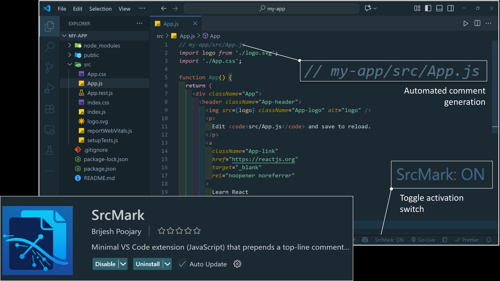

# SrcMark 

**SrcMark** is a lightweight VS Code extension that automatically adds a **file location comment** at the top of any **opened or newly created file**, showing its full path within the project — or just the filename when a single file is open.

---

## 🚀 Features

- **Smart Path Commenting**: Prepends a comment such as  
  `// project/src/components/App.js` at the top of opened files.  
- **On-Demand Execution**: Runs **only when you open or create a file**, optimizing memory and performance.  
- **Auto Syntax Detection**: Supports 60+ languages with correct comment styles (`//`, `#`, `<!-- -->`, etc.).  
- **Project & Single-File Mode**: Automatically adjusts comment format based on workspace or single-file usage.  
- **Duplicate Prevention**: Detects and skips files already tagged.  
- **Folder Ignore Logic**: Automatically ignores `.git`, `node_modules`, `dist`, and `build`.  
- **Universal Compatibility**: Works with frameworks like React, Django, Spring Boot, Flutter, and more.

---

## ⚡ Installation

1. Open **VS Code**.  
2. Go to **Extensions** (Ctrl+Shift+X or ⌘+Shift+X on Mac).  
3. Search for **SrcMark**.  
4. Click **Install**.  
5. Reload VS Code if prompted.

---

## 🧩 Usage

- **Automatic**: When you **open or create a file**, SrcMark automatically adds a path comment at the top.  
- **Manual Commands**:  
  - `SrcMark: Toggle On/Off` – Enable or disable automatic commenting.  
  - `SrcMark: Add Comment to Current File` – Add/update the comment for the active file.

---

## ⚙️ Settings

You can configure SrcMark in **Settings → Extensions → SrcMark**:

| Setting | Default | Description |
|---------|---------|-------------|
| `srcmark.enabled` | `true` | Enable or disable the extension. |
| `srcmark.autoDetectComment` | `true` | Automatically detect comment style for each language. |
| `srcmark.commentPrefix` | `null` | Use a fixed comment prefix if auto-detect is off. |
| `srcmark.ignoreFolders` | `[ ".git", "node_modules", "dist", "build" ]` | Folders ignored during processing. |
| `srcmark.skipIfPresent` | `true` | Skip files that already have the comment. |
| `srcmark.processOnlyOnView` | `true` | Only add comments to files you open or view. |

---

## 📝 Notes

- Files without comment support (like JSON) are skipped.  
- SrcMark never overwrites or auto-saves files.  
- Fully optimized for performance — processes **only visible files**.  
- Works seamlessly in multi-root workspaces.

---

**Enjoy clean, organized code with SrcMark!**
